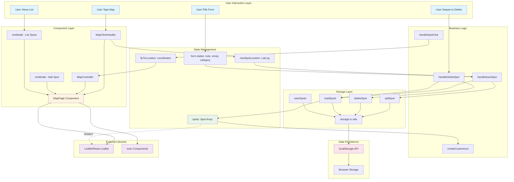

# My Spot App# My Spot App


A location-based map application built with Ionic React for exploring and bookmarking favorite places with Firebase authentication.A location-based map application built with Ionic React for exploring and bookmarking favorite places with custom notes, emojis, and Firebase authentication.


**Live Demo**: [https://myspotr0334.netlify.app/](https://myspotr0334.netlify.app/)## Live Demo


---**Deployed App**: [https://myspotr0334.netlify.app/](https://myspotr0334.netlify.app/)


## Quick StartTry it out! Log in or create an account, tap the map to add spots, swipe to delete, and click spots in the list to fly to their location.


### Prerequisites---


- Node.js (v16+)## Table of Contents

- npm

- Git- [Getting Started](#getting-started)

- Code editor (VS Code recommended)- [Environment Setup](#environment-setup)

- [Project Structure](#project-structure)

### Installation- [Features](#features)

- [Authentication](#authentication)

1. **Clone and install**- [Form Validation](#form-validation)

```bash- [Architecture Overview](#architecture-overview)

git clone <your-repo-url>- [Development Guide](#development-guide)

cd groupworkapp-second-login- [Troubleshooting](#troubleshooting)

npm install- [Resources](#resources)

```

---

2. **Set up environment variables**

```bash## Getting Started

# Windows

Copy-Item .env.example .env### Prerequisites


# Mac/LinuxBefore you begin, make sure you have the following installed on your computer:

cp .env.example .env

```1. **Node.js** (version 16 or higher)

   - Check your version: `node --version`

3. **Configure Firebase credentials**   - Download from: https://nodejs.org/

   

Edit `.env` and add your Firebase credentials:2. **npm** (comes with Node.js)

```env   - Check your version: `npm --version`

VITE_FIREBASE_API_KEY=your_api_key   

VITE_FIREBASE_AUTH_DOMAIN=your_auth_domain3. **Git** (for cloning the repository)

VITE_FIREBASE_PROJECT_ID=your_project_id   - Check your version: `git --version`

VITE_FIREBASE_STORAGE_BUCKET=your_storage_bucket   - Download from: https://git-scm.com/

VITE_FIREBASE_MESSAGING_SENDER_ID=your_sender_id

VITE_FIREBASE_APP_ID=your_app_id4. **A code editor** (recommended: Visual Studio Code)

```   - Download from: https://code.visualstudio.com/


**Where to get credentials:**### Step-by-Step Installation

- Ask your team lead, OR

- Go to [Firebase Console](https://console.firebase.google.com/) > Project Settings > Your apps#### Step 1: Clone the Repository


4. **Run the app**Open your terminal (Command Prompt on Windows, Terminal on Mac/Linux) and run:

```bash

npm run dev```bash

# or# Clone the repository

ionic servegit clone <your-repo-url>

```

# Navigate into the project folder

Open `http://localhost:5173/` in your browser.cd groupworkapp-second-login

```

---

#### Step 2: Install Project Dependencies

## Project Structure

This will download all the libraries and packages the project needs:

```

src/```bash

├── components/npm install

│   └── MapController.tsx       # Map navigation logic```

├── pages/

│   ├── Login.tsx              # Login with Firebase auth**What this does**: Reads the `package.json` file and installs all listed dependencies into a `node_modules` folder.

│   ├── SignUp.tsx             # User registration

│   └── MapPage.tsx            # Main map interface**If you see errors**: Try running `npm install --legacy-peer-deps`

├── types/

│   └── Spot.ts                # TypeScript interfaces#### Step 3: Set Up Environment Variables

├── utils/

│   └── storage.ts             # LocalStorage utilitiesEnvironment variables are used to store sensitive information (like Firebase credentials) that should not be committed to version control.

├── firebaseConfig.ts          # Firebase setup (uses .env)

└── App.tsx                    # Main app with routing**On Windows (PowerShell):**

``````powershell

Copy-Item .env.example .env

---```


## Features**On Mac/Linux:**

```bash

### Authenticationcp .env.example .env

- Email/password login via Firebase```

- User registration with validation

- Password reset functionality**Manual method** (if commands don't work):

- "Remember me" option1. Find the `.env.example` file in the project root

2. Create a copy of it

### Form Validation (Yup)3. Rename the copy to `.env` (just `.env`, no extension)

- Email format validation

- Password strength requirements (6+ characters, must contain letters)#### Step 4: Configure Your Firebase Credentials

- Password confirmation matching

- User-friendly error messagesOpen the newly created `.env` file in your code editor and replace the placeholder values:


### Security```env

- Firebase credentials in environment variables (not hardcoded)VITE_FIREBASE_API_KEY=your_actual_api_key_here

- Client-side rate limiting (1 minute cooldown for signups)VITE_FIREBASE_AUTH_DOMAIN=your_actual_auth_domain_here

- Input sanitization and validationVITE_FIREBASE_PROJECT_ID=your_actual_project_id_here

VITE_FIREBASE_STORAGE_BUCKET=your_actual_storage_bucket_here

### Map FeaturesVITE_FIREBASE_MESSAGING_SENDER_ID=your_actual_messaging_sender_id_here

- Interactive Leaflet map with OpenStreetMapVITE_FIREBASE_APP_ID=your_actual_app_id_here

- Tap to add custom markers```

- Color-coded categories (Cafe, Park, Restaurant, Secret Spot, Other)

- Swipe-to-delete spots**Where to get these values:**

- Click spot to fly to location- Ask your team lead for the Firebase credentials

- LocalStorage persistence- Or, if you're setting up your own Firebase project:

  1. Go to https://console.firebase.google.com/

---  2. Create a new project or select existing one

  3. Go to Project Settings (gear icon)

## Architecture Overview  4. Scroll down to "Your apps" section

  5. Click on the web app (</> icon)

```mermaid  6. Copy the config values from `firebaseConfig` object

graph TB

    subgraph "User Interaction Layer"**Important notes:**

        A[User Taps Map] - Each value should be on its own line

        B[User Fills Form]- No quotes around the values

        C[User Views List]- No spaces before or after the `=` sign

        D[User Swipes to Delete]- The prefix `VITE_` is required for Vite to expose these variables

    end

    #### Step 5: Start the Development Server

    subgraph "Component Layer"

        E[MapPage Component]```bash

        F[MapClickHandler]npm run dev

        G[MapController]```

        H[IonModal - Add Spot]

        I[IonModal - List Spots]**Alternative command:**

    end```bash

    ionic serve

    subgraph "State Management"```

        J[spots: Spot Array]

        K[newSpotLocation: LatLng]**What this does**: Starts a local web server that runs your application.

        L[flyToLocation: coordinates]

        M[form states: note, emoji, category]**Expected output:**

    end```

      VITE v4.4.5  ready in 500 ms

    subgraph "Business Logic"

        N[handleSaveSpot]  ➜  Local:   http://localhost:5173/

        O[handleDeleteSpot]  ➜  Network: use --host to expose

        P[handleSpotClick]```

        Q[createCustomIcon]

    end#### Step 6: Open the Application

    

    subgraph "Storage Layer"Open your web browser and go to: `http://localhost:5173/`

        R[storage.ts utils]

        S[loadSpots]You should see the login page of the My Spot App.

        T[saveSpots]

        U[addSpot]---

        V[deleteSpot]

    end## Environment Setup

    

    subgraph "Data Persistence"### Understanding Environment Variables

        W[localStorage API]

        X[Browser Storage]Environment variables are key-value pairs that store configuration data outside of your code. This is important for:

    end

    1. **Security**: Keeps sensitive data (like API keys) out of your source code

    subgraph "External Libraries"2. **Flexibility**: Different environments (development, staging, production) can have different values

        Y[Leaflet/React-Leaflet]3. **Collaboration**: Team members can have their own credentials without conflicts

        Z[Ionic Components]

    end### Required Environment Variables

    

    A --> FThis project requires the following variables:

    F --> K

    B --> M| Variable | Description | Example |

    C --> I|----------|-------------|---------|

    D --> O| `VITE_FIREBASE_API_KEY` | Your Firebase project's API key | AIzaSyD... |

    | `VITE_FIREBASE_AUTH_DOMAIN` | Firebase authentication domain | myapp-12345.firebaseapp.com |

    F --> E| `VITE_FIREBASE_PROJECT_ID` | Your Firebase project ID | myapp-12345 |

    G --> E| `VITE_FIREBASE_STORAGE_BUCKET` | Firebase storage bucket URL | myapp-12345.appspot.com |

    H --> E| `VITE_FIREBASE_MESSAGING_SENDER_ID` | Firebase Cloud Messaging sender ID | 123456789 |

    I --> E| `VITE_FIREBASE_APP_ID` | Firebase app identifier | 1:123456789:web:abc123 |

    

    K --> N### Why VITE_ Prefix?

    M --> N

    L --> GVite (the build tool we use) only exposes environment variables that start with `VITE_` to the client-side code. This is a security feature to prevent accidentally exposing server-side secrets.

    

    N --> U### Security Best Practices

    O --> V

    P --> L**DO:**

    J --> Q- Keep your `.env` file in the project root directory

    - Use `.env.example` as a template for team members

    U --> R- Add `.env` to `.gitignore` (already done in this project)

    V --> R- Use different Firebase projects for development and production

    S --> R

    T --> R**DON'T:**

    - Never commit `.env` to version control

    R --> W- Never share your `.env` file publicly

    W --> X- Never hardcode credentials in your source code

    - Never push `.env` to GitHub, even in private repos

    E --> Y

    E --> Z### Setting Up for Deployment

    

    S --> JWhen deploying to a hosting platform (like Netlify, Vercel, or Heroku):

    N --> S

    O --> S1. The `.env` file will NOT be deployed (it's gitignored)

    2. You must add environment variables in your hosting platform's dashboard

    J -.renders.-> Y3. Each platform has a different interface for this:

       - **Netlify**: Site Settings > Build & Deploy > Environment

    style A fill:#e1f5ff   - **Vercel**: Project Settings > Environment Variables

    style B fill:#e1f5ff   - **Heroku**: Settings > Config Vars

    style C fill:#e1f5ff

    style D fill:#e1f5ff---

    style E fill:#fff4e1

    style J fill:#e8f5e9---

    style W fill:#fce4ec

    style Y fill:#f3e5f5## Project Structure

    style Z fill:#f3e5f5

```Understanding the project structure will help you navigate the codebase:


---```

groupworkapp-second-login/

## Development├── src/

│   ├── components/

### Common Commands│   │   └── MapController.tsx      # Controls map navigation and flyTo animations

│   ├── pages/

```bash│   │   ├── Login.tsx              # Login page with Firebase authentication

# Start dev server│   │   ├── Login.css              # Styles for login page

npm run dev│   │   ├── SignUp.tsx             # Registration page with validation

│   │   ├── SignUp.css             # Styles for signup page

# Build for production│   │   ├── MapPage.tsx            # Main map view with spot management

npm run build│   │   └── MapPage.css            # Styles for map page

│   ├── types/

# Preview production build│   │   └── Spot.ts                # TypeScript interfaces and types for spots

npm run preview│   ├── utils/

│   │   └── storage.ts             # LocalStorage operations for spot data

# Install new package│   ├── firebaseConfig.ts          # Firebase initialization (uses env variables)

npm install package-name│   ├── App.tsx                    # Root component with routing setup

```│   ├── main.tsx                   # Application entry point

│   └── vite-env.d.ts              # TypeScript declarations for environment variables

### Environment Variables├── .env                           # Your local environment variables (DO NOT COMMIT)

├── .env.example                   # Template for environment variables (safe to commit)

**Important Notes:**├── .gitignore                     # Files and folders to exclude from git

- Variables must start with `VITE_` prefix (Vite requirement)├── package.json                   # Project dependencies and scripts

- No quotes around values├── tsconfig.json                  # TypeScript configuration

- No spaces around `=` sign├── vite.config.ts                 # Vite build tool configuration

- Restart dev server after changing `.env`└── README.md                      # This file

```

**Example:**

```env### Key Files Explained

VITE_FIREBASE_API_KEY=AIzaSyAbc123  ✓ Correct

VITE_FIREBASE_API_KEY = "AIzaSyAbc123"  ✗ Wrong (has spaces and quotes)**src/firebaseConfig.ts**

FIREBASE_API_KEY=AIzaSyAbc123  ✗ Wrong (missing VITE_ prefix)- Initializes Firebase app with environment variables

```- Exports authentication instance used throughout the app

- Uses `import.meta.env` to access Vite environment variables

---

**src/pages/Login.tsx**

## Troubleshooting- Handles user login with email and password

- Includes password reset functionality

### npm install fails- Uses Yup for form validation

```bash- Displays user-friendly error messages

npm install --legacy-peer-deps- Includes loading states and rate limiting

```

**src/pages/SignUp.tsx**

### Environment variables not working- Handles new user registration

1. Check file is named `.env` (not `.env.txt`)- Validates email format and password strength

2. Restart dev server after changes- Confirms password matching

3. Verify `VITE_` prefix on all variables- Implements client-side rate limiting (1 minute cooldown)

- Uses Yup schema for validation

### Changes not reflecting

- Hard refresh: `Ctrl + Shift + R` (Windows) or `Cmd + Shift + R` (Mac)**src/utils/storage.ts**

- Clear browser cache- Provides functions to interact with browser's localStorage

- Restart dev server- Functions: `loadSpots()`, `addSpot()`, `deleteSpot()`, `updateSpot()`

- Handles JSON serialization and deserialization

### Firebase auth not working

1. Check credentials in `.env` are correct**src/types/Spot.ts**

2. Enable Email/Password auth in Firebase Console- Defines TypeScript interfaces for type safety

3. Go to Authentication > Sign-in method > Enable Email/Password- Includes `Spot` interface and `SpotCategory` enum

- Maps categories to colors for visual coding

---

---

## Tech Stack

## Features

- **Ionic React** 8.x - Cross-platform UI framework

- **React** 18.x - UI library### Authentication System

- **TypeScript** 5.x - Type safety

- **Vite** 4.x - Build tool**Login Page**

- **Firebase** - Authentication- Email and password authentication via Firebase

- **Yup** - Form validation- "Remember me" checkbox to save email locally

- **Leaflet** 1.9.x - Interactive maps- Password reset functionality (sends email via Firebase)

- **React-Leaflet** 4.x - React wrapper for Leaflet- Form validation with user-friendly error messages

- Loading spinner during authentication

---- Graceful error handling for common issues:

  - Invalid credentials

## Resources  - User not found

  - Too many failed attempts

### Documentation  - Network errors

- [Ionic React](https://ionicframework.com/docs/react)

- [Firebase Auth](https://firebase.google.com/docs/auth/web/start)**Sign Up Page**

- [Yup Validation](https://github.com/jquense/yup)- New user registration with Firebase

- [Leaflet](https://leafletjs.com/reference.html)- Email format validation

- [React Leaflet](https://react-leaflet.js.org/)- Password strength requirements:

  - Minimum 6 characters (Firebase requirement)

### Learning  - Recommended 8+ characters

- [React Tutorial](https://react.dev/learn)  - Must contain letters

- [TypeScript Handbook](https://www.typescriptlang.org/docs/handbook/intro.html)- Password confirmation field

- [JavaScript ES6+](https://javascript.info/)- Client-side rate limiting (1 minute between attempts)

- Protection against abuse

---

### Map Features

## License

- Interactive Leaflet map with OpenStreetMap tiles

This is a learning project for coursework. Repository will be archived 15 days after submission deadline.- Tap anywhere on the map to drop a new pin

- Custom markers with emoji and category-based colors

---- Five categories: Cafe, Park, Restaurant, Secret Spot, Other

- LocalStorage persistence (survives page refresh)

*Last updated: October 2025*- Mobile-responsive design

- Swipe-to-delete functionality in spot list
- Click-to-navigate feature (flies map to selected spot)

---

## Authentication

### How Firebase Authentication Works

1. **Sign Up Flow**:
   - User enters email and password
   - Form is validated using Yup schema
   - Firebase creates new user account
   - User is redirected to login page

2. **Login Flow**:
   - User enters credentials
   - Firebase verifies credentials
   - On success, user is redirected to map page
   - Authentication token is stored in browser

3. **Password Reset**:
   - User clicks "Forgot password?"
   - Enters email address
   - Firebase sends password reset email
   - User follows link in email to reset password

### Protected Routes

The map page (`/map`) is protected and requires authentication. If a user tries to access it without logging in, they should be redirected to the login page (implementation depends on your routing setup).

---

## Form Validation

This project uses **Yup** for form validation. Yup is a JavaScript schema validation library that makes form validation declarative and easy to maintain.

### Why Yup?

**Before Yup (Hardcoded Validation):**
```typescript
if (!email.trim()) {
  setError('Please enter your email');
  return;
}
const emailRegex = /^[^\s@]+@[^\s@]+\.[^\s@]+$/;
if (!emailRegex.test(email)) {
  setError('Invalid email format');
  return;
}
if (!password) {
  setError('Please enter password');
  return;
}
if (password.length < 6) {
  setError('Password too short');
  return;
}
```

**With Yup (Declarative Schema):**
```typescript
const schema = yup.object().shape({
  email: yup.string()
    .email('Invalid email format')
    .required('Please enter your email'),
  password: yup.string()
    .required('Please enter password')
    .min(6, 'Password too short')
});

await schema.validate({ email, password });
```

### Benefits of Using Yup

1. **Cleaner Code**: Validation rules are centralized
2. **Reusable**: Schemas can be exported and reused
3. **Maintainable**: Easy to add or modify validation rules
4. **Type-Safe**: Works great with TypeScript
5. **Consistent**: Standard library used by many projects

### Validation Schemas in This Project

**Login Schema** (in `src/pages/Login.tsx`):
```typescript
const loginSchema = yup.object().shape({
  email: yup
    .string()
    .email('Please enter a valid email address.')
    .required('Please enter your email address.'),
  password: yup
    .string()
    .required('Please enter your password.')
});
```

**Sign Up Schema** (in `src/pages/SignUp.tsx`):
```typescript
const signupSchema = yup.object().shape({
  email: yup
    .string()
    .email('Please enter a valid email address.')
    .required('Please enter your email address.'),
  password: yup
    .string()
    .required('Please enter a password.')
    .min(6, 'Password must be at least 6 characters long.')
    .min(8, 'For better security, use at least 8 characters.')
    .matches(/[a-zA-Z]/, 'Password should contain letters.'),
  confirmPassword: yup
    .string()
    .required('Please confirm your password.')
    .oneOf([yup.ref('password')], 'Passwords do not match.')
});
```

### How to Use Yup Validation

```typescript
try {
  // Validate form data against schema
  await schema.validate(
    { email, password, confirmPassword },
    { abortEarly: false } // Check all fields, not just first error
  );
  
  // If validation passes, continue with submission
  handleSubmit();
  
} catch (validationError) {
  // Show first error message to user
  setError(validationError.errors[0]);
}
```

---



### Data Flow Explanation

1. **User Interaction → Component**: User taps map, triggering `MapClickHandler` which captures coordinates
2. **Component → State**: Coordinates stored in `newSpotLocation` state, modal opens
3. **State → Business Logic**: User submits form, `handleSaveSpot` creates Spot object
4. **Business Logic → Storage**: `addSpot()` utility adds spot to localStorage
5. **Storage → Persistence**: Data serialized to JSON and saved in browser storage
6. **Persistence → State**: `loadSpots()` retrieves data, updates `spots` state
7. **State → Render**: Leaflet renders markers using custom icons based on spot data

## 📂 Project Structure

```
src/
├── components/
│   └── MapController.tsx      # Handles map navigation/flyTo
├── pages/
│   ├── MapPage.tsx            # Main map view (needs refactoring)
│   └── MapPage.css            # Responsive styles
├── types/
│   └── Spot.ts                # TypeScript interfaces & enums
└── utils/
    └── storage.ts             # localStorage CRUD operations
```

## 🛠️ Tech Stack

- **Framework**: Ionic React 8.x
- **UI Library**: React 18.x
- **Language**: TypeScript 5.x
- **Build Tool**: Vite 4.x
- **Map Library**: Leaflet 1.9.x + React-Leaflet 4.x
- **Storage**: Browser localStorage API
- **Icons**: Ionicons

## � Implementation Details

### Core Functionality

**Storage Layer** (`src/utils/storage.ts`)
- Implemented full CRUD operations for localStorage
- Functions: `loadSpots()`, `saveSpots()`, `addSpot()`, `deleteSpot()`, `updateSpot()`, `clearAllSpots()`
- Proper JSON serialization/deserialization with null handling

**Map Interactions** (`src/pages/MapPage.tsx`)
- Click-to-add spots using `useMapEvents` hook from react-leaflet
- Custom marker icons with `L.divIcon()` displaying category colors and emojis
- Fly-to navigation feature using separate `MapController` component
- Form validation and state management for new spots

**UI Components**
- IonModal for adding new spots with form inputs
- IonModal for listing all spots with swipe-to-delete
- IonFab button for quick access to spot list
- Responsive CSS with mobile-optimized touch targets

### Key Technical Decisions

1. **localStorage over Backend**: Kept it simple for a learning project, perfect for understanding client-side persistence
2. **Separate MapController**: Isolated map navigation logic into its own component for better separation of concerns
3. **Demo Spot**: Added welcome spot on first launch to immediately show app functionality
4. **Category Colors**: Used TypeScript Record type for type-safe color mapping

## 📝 Development Notes

**App runs at**: `http://localhost:5173` (Vite dev server) or via `ionic serve`

**Known Limitations**:
- No data synchronization across devices
- Large monolithic MapPage.tsx component (future refactor needed)
- Basic error handling
- No unit tests implemented

**Future Improvements**:
- [ ] Break down MapPage into smaller components
- [ ] Add photo upload with Capacitor Camera API
- [ ] Implement geolocation for "current location" feature
- [ ] Add spot categories filter/search
- [ ] Export/import spots as JSON
- [ ] Add proper error boundaries

## 📚 Resources Used

- [Ionic React Documentation](https://ionicframework.com/docs/react)
- [Leaflet API Reference](https://leafletjs.com/reference.html)
- [React Leaflet Guide](https://react-leaflet.js.org/)
- [MDN Web Docs - localStorage](https://developer.mozilla.org/en-US/docs/Web/API/Window/localStorage)

## 📄 License

This is a learning project for **Lab 3** coursework. Repository will be archived 15 days after the submission deadline.

---

*This README was improved and organized by **Claude Sonnet 3.5** AI assistant.*
---

## Development Guide

### Running the Application

**Start Development Server:**
```bash
npm run dev
```
or
```bash
ionic serve
```

The app will be available at `http://localhost:5173/`

**What happens when you run this:**
1. Vite starts a development server
2. TypeScript files are compiled to JavaScript
3. Environment variables from `.env` are loaded
4. Browser opens automatically
5. Hot Module Replacement (HMR) is enabled (changes reflect instantly)

### Building for Production

```bash
npm run build
```

**What this creates:**
- Optimized production build in `dist/` folder
- Minified JavaScript and CSS
- Tree-shaken code (unused code removed)
- Source maps for debugging

### Running Production Build Locally

```bash
npm run preview
```

This serves the production build locally for testing before deployment.

---

## Troubleshooting

### Issue: npm install fails

**Solution 1**: Try with legacy peer deps
```bash
npm install --legacy-peer-deps
```

**Solution 2**: Delete node_modules and try again
```bash
# Windows
rmdir /s /q node_modules
del package-lock.json
npm install
```

### Issue: Environment variables not working

**Checklist:**
1. File is named exactly `.env` (not `.env.txt`)
2. Variables start with `VITE_` prefix
3. No quotes around values
4. No spaces around `=` sign
5. Restart development server after changing `.env`

### Issue: Changes not reflecting in browser

**Solutions:**
1. Hard refresh: `Ctrl + Shift + R` (Windows) or `Cmd + Shift + R` (Mac)
2. Clear browser cache
3. Restart development server
4. Check if file is saved

---

## License


*README updated with detailed instructions for junior developers. Last updated: October 2025*
