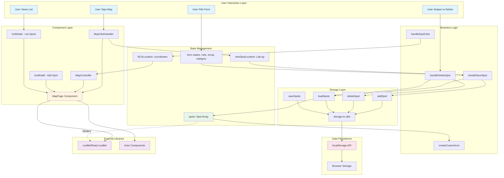

# My Spot App

A location-based map application built with Ionic React for exploring and bookmarking favorite places with custom notes, emojis, and Firebase authentication.

## Live Demo

**Deployed App**: [https://myspotr0334.netlify.app/](https://myspotr0334.netlify.app/)

Try it out! Log in or create an account, tap the map to add spots, swipe to delete, and click spots in the list to fly to their location.

---

## Table of Contents

- [Getting Started](#getting-started)
- [Environment Setup](#environment-setup)
- [Project Structure](#project-structure)
- [Features](#features)
- [Authentication](#authentication)
- [Form Validation](#form-validation)
- [Architecture Overview](#architecture-overview)
- [Development Guide](#development-guide)
- [Troubleshooting](#troubleshooting)
- [Resources](#resources)

---

## Getting Started

### Prerequisites

Before you begin, make sure you have the following installed on your computer:

1. **Node.js** (version 16 or higher)
   - Check your version: `node --version`
   - Download from: https://nodejs.org/
   
2. **npm** (comes with Node.js)
   - Check your version: `npm --version`
   
3. **Git** (for cloning the repository)
   - Check your version: `git --version`
   - Download from: https://git-scm.com/

4. **A code editor** (recommended: Visual Studio Code)
   - Download from: https://code.visualstudio.com/

### Step-by-Step Installation

#### Step 1: Clone the Repository

Open your terminal (Command Prompt on Windows, Terminal on Mac/Linux) and run:

```bash
# Clone the repository
git clone <your-repo-url>

# Navigate into the project folder
cd groupworkapp-second-login
```

#### Step 2: Install Project Dependencies

This will download all the libraries and packages the project needs:

```bash
npm install
```

**What this does**: Reads the `package.json` file and installs all listed dependencies into a `node_modules` folder.

**If you see errors**: Try running `npm install --legacy-peer-deps`

#### Step 3: Set Up Environment Variables

Environment variables are used to store sensitive information (like Firebase credentials) that should not be committed to version control.

**On Windows (PowerShell):**
```powershell
Copy-Item .env.example .env
```

**On Mac/Linux:**
```bash
cp .env.example .env
```

**Manual method** (if commands don't work):
1. Find the `.env.example` file in the project root
2. Create a copy of it
3. Rename the copy to `.env` (just `.env`, no extension)

#### Step 4: Configure Your Firebase Credentials

Open the newly created `.env` file in your code editor and replace the placeholder values:

```env
VITE_FIREBASE_API_KEY=your_actual_api_key_here
VITE_FIREBASE_AUTH_DOMAIN=your_actual_auth_domain_here
VITE_FIREBASE_PROJECT_ID=your_actual_project_id_here
VITE_FIREBASE_STORAGE_BUCKET=your_actual_storage_bucket_here
VITE_FIREBASE_MESSAGING_SENDER_ID=your_actual_messaging_sender_id_here
VITE_FIREBASE_APP_ID=your_actual_app_id_here
```

**Where to get these values:**
- Ask your team lead for the Firebase credentials
- Or, if you're setting up your own Firebase project:
  1. Go to https://console.firebase.google.com/
  2. Create a new project or select existing one
  3. Go to Project Settings (gear icon)
  4. Scroll down to "Your apps" section
  5. Click on the web app (</> icon)
  6. Copy the config values from `firebaseConfig` object

**Important notes:**
- Each value should be on its own line
- No quotes around the values
- No spaces before or after the `=` sign
- The prefix `VITE_` is required for Vite to expose these variables

#### Step 5: Start the Development Server

```bash
npm run dev
```

**Alternative command:**
```bash
ionic serve
```

**What this does**: Starts a local web server that runs your application.

**Expected output:**
```
  VITE v4.4.5  ready in 500 ms

  ➜  Local:   http://localhost:5173/
  ➜  Network: use --host to expose
```

#### Step 6: Open the Application

Open your web browser and go to: `http://localhost:5173/`

You should see the login page of the My Spot App.

---

## Environment Setup

### Understanding Environment Variables

Environment variables are key-value pairs that store configuration data outside of your code. This is important for:

1. **Security**: Keeps sensitive data (like API keys) out of your source code
2. **Flexibility**: Different environments (development, staging, production) can have different values
3. **Collaboration**: Team members can have their own credentials without conflicts

### Required Environment Variables

This project requires the following variables:

| Variable | Description | Example |
|----------|-------------|---------|
| `VITE_FIREBASE_API_KEY` | Your Firebase project's API key | AIzaSyD... |
| `VITE_FIREBASE_AUTH_DOMAIN` | Firebase authentication domain | myapp-12345.firebaseapp.com |
| `VITE_FIREBASE_PROJECT_ID` | Your Firebase project ID | myapp-12345 |
| `VITE_FIREBASE_STORAGE_BUCKET` | Firebase storage bucket URL | myapp-12345.appspot.com |
| `VITE_FIREBASE_MESSAGING_SENDER_ID` | Firebase Cloud Messaging sender ID | 123456789 |
| `VITE_FIREBASE_APP_ID` | Firebase app identifier | 1:123456789:web:abc123 |

### Why VITE_ Prefix?

Vite (the build tool we use) only exposes environment variables that start with `VITE_` to the client-side code. This is a security feature to prevent accidentally exposing server-side secrets.

### Security Best Practices

**DO:**
- Keep your `.env` file in the project root directory
- Use `.env.example` as a template for team members
- Add `.env` to `.gitignore` (already done in this project)
- Use different Firebase projects for development and production

**DON'T:**
- Never commit `.env` to version control
- Never share your `.env` file publicly
- Never hardcode credentials in your source code
- Never push `.env` to GitHub, even in private repos

### Setting Up for Deployment

When deploying to a hosting platform (like Netlify, Vercel, or Heroku):

1. The `.env` file will NOT be deployed (it's gitignored)
2. You must add environment variables in your hosting platform's dashboard
3. Each platform has a different interface for this:
   - **Netlify**: Site Settings > Build & Deploy > Environment
   - **Vercel**: Project Settings > Environment Variables
   - **Heroku**: Settings > Config Vars

---

---

## Project Structure

Understanding the project structure will help you navigate the codebase:

```
groupworkapp-second-login/
├── src/
│   ├── components/
│   │   └── MapController.tsx      # Controls map navigation and flyTo animations
│   ├── pages/
│   │   ├── Login.tsx              # Login page with Firebase authentication
│   │   ├── Login.css              # Styles for login page
│   │   ├── SignUp.tsx             # Registration page with validation
│   │   ├── SignUp.css             # Styles for signup page
│   │   ├── MapPage.tsx            # Main map view with spot management
│   │   └── MapPage.css            # Styles for map page
│   ├── types/
│   │   └── Spot.ts                # TypeScript interfaces and types for spots
│   ├── utils/
│   │   └── storage.ts             # LocalStorage operations for spot data
│   ├── firebaseConfig.ts          # Firebase initialization (uses env variables)
│   ├── App.tsx                    # Root component with routing setup
│   ├── main.tsx                   # Application entry point
│   └── vite-env.d.ts              # TypeScript declarations for environment variables
├── .env                           # Your local environment variables (DO NOT COMMIT)
├── .env.example                   # Template for environment variables (safe to commit)
├── .gitignore                     # Files and folders to exclude from git
├── package.json                   # Project dependencies and scripts
├── tsconfig.json                  # TypeScript configuration
├── vite.config.ts                 # Vite build tool configuration
└── README.md                      # This file
```

### Key Files Explained

**src/firebaseConfig.ts**
- Initializes Firebase app with environment variables
- Exports authentication instance used throughout the app
- Uses `import.meta.env` to access Vite environment variables

**src/pages/Login.tsx**
- Handles user login with email and password
- Includes password reset functionality
- Uses Yup for form validation
- Displays user-friendly error messages
- Includes loading states and rate limiting

**src/pages/SignUp.tsx**
- Handles new user registration
- Validates email format and password strength
- Confirms password matching
- Implements client-side rate limiting (1 minute cooldown)
- Uses Yup schema for validation

**src/utils/storage.ts**
- Provides functions to interact with browser's localStorage
- Functions: `loadSpots()`, `addSpot()`, `deleteSpot()`, `updateSpot()`
- Handles JSON serialization and deserialization

**src/types/Spot.ts**
- Defines TypeScript interfaces for type safety
- Includes `Spot` interface and `SpotCategory` enum
- Maps categories to colors for visual coding

---

## Features

### Authentication System

**Login Page**
- Email and password authentication via Firebase
- "Remember me" checkbox to save email locally
- Password reset functionality (sends email via Firebase)
- Form validation with user-friendly error messages
- Loading spinner during authentication
- Graceful error handling for common issues:
  - Invalid credentials
  - User not found
  - Too many failed attempts
  - Network errors

**Sign Up Page**
- New user registration with Firebase
- Email format validation
- Password strength requirements:
  - Minimum 6 characters (Firebase requirement)
  - Recommended 8+ characters
  - Must contain letters
- Password confirmation field
- Client-side rate limiting (1 minute between attempts)
- Protection against abuse

### Map Features

- Interactive Leaflet map with OpenStreetMap tiles
- Tap anywhere on the map to drop a new pin
- Custom markers with emoji and category-based colors
- Five categories: Cafe, Park, Restaurant, Secret Spot, Other
- LocalStorage persistence (survives page refresh)
- Mobile-responsive design
- Swipe-to-delete functionality in spot list
- Click-to-navigate feature (flies map to selected spot)

---

## Authentication

### How Firebase Authentication Works

1. **Sign Up Flow**:
   - User enters email and password
   - Form is validated using Yup schema
   - Firebase creates new user account
   - User is redirected to login page

2. **Login Flow**:
   - User enters credentials
   - Firebase verifies credentials
   - On success, user is redirected to map page
   - Authentication token is stored in browser

3. **Password Reset**:
   - User clicks "Forgot password?"
   - Enters email address
   - Firebase sends password reset email
   - User follows link in email to reset password

### Protected Routes

The map page (`/map`) is protected and requires authentication. If a user tries to access it without logging in, they should be redirected to the login page (implementation depends on your routing setup).

---

## Form Validation

This project uses **Yup** for form validation. Yup is a JavaScript schema validation library that makes form validation declarative and easy to maintain.

### Why Yup?

**Before Yup (Hardcoded Validation):**
```typescript
if (!email.trim()) {
  setError('Please enter your email');
  return;
}
const emailRegex = /^[^\s@]+@[^\s@]+\.[^\s@]+$/;
if (!emailRegex.test(email)) {
  setError('Invalid email format');
  return;
}
if (!password) {
  setError('Please enter password');
  return;
}
if (password.length < 6) {
  setError('Password too short');
  return;
}
```

**With Yup (Declarative Schema):**
```typescript
const schema = yup.object().shape({
  email: yup.string()
    .email('Invalid email format')
    .required('Please enter your email'),
  password: yup.string()
    .required('Please enter password')
    .min(6, 'Password too short')
});

await schema.validate({ email, password });
```

### Benefits of Using Yup

1. **Cleaner Code**: Validation rules are centralized
2. **Reusable**: Schemas can be exported and reused
3. **Maintainable**: Easy to add or modify validation rules
4. **Type-Safe**: Works great with TypeScript
5. **Consistent**: Standard library used by many projects

### Validation Schemas in This Project

**Login Schema** (in `src/pages/Login.tsx`):
```typescript
const loginSchema = yup.object().shape({
  email: yup
    .string()
    .email('Please enter a valid email address.')
    .required('Please enter your email address.'),
  password: yup
    .string()
    .required('Please enter your password.')
});
```

**Sign Up Schema** (in `src/pages/SignUp.tsx`):
```typescript
const signupSchema = yup.object().shape({
  email: yup
    .string()
    .email('Please enter a valid email address.')
    .required('Please enter your email address.'),
  password: yup
    .string()
    .required('Please enter a password.')
    .min(6, 'Password must be at least 6 characters long.')
    .min(8, 'For better security, use at least 8 characters.')
    .matches(/[a-zA-Z]/, 'Password should contain letters.'),
  confirmPassword: yup
    .string()
    .required('Please confirm your password.')
    .oneOf([yup.ref('password')], 'Passwords do not match.')
});
```

### How to Use Yup Validation

```typescript
try {
  // Validate form data against schema
  await schema.validate(
    { email, password, confirmPassword },
    { abortEarly: false } // Check all fields, not just first error
  );
  
  // If validation passes, continue with submission
  handleSubmit();
  
} catch (validationError) {
  // Show first error message to user
  setError(validationError.errors[0]);
}
```

---



### Data Flow Explanation

1. **User Interaction → Component**: User taps map, triggering `MapClickHandler` which captures coordinates
2. **Component → State**: Coordinates stored in `newSpotLocation` state, modal opens
3. **State → Business Logic**: User submits form, `handleSaveSpot` creates Spot object
4. **Business Logic → Storage**: `addSpot()` utility adds spot to localStorage
5. **Storage → Persistence**: Data serialized to JSON and saved in browser storage
6. **Persistence → State**: `loadSpots()` retrieves data, updates `spots` state
7. **State → Render**: Leaflet renders markers using custom icons based on spot data

## 📂 Project Structure

```
src/
├── components/
│   └── MapController.tsx      # Handles map navigation/flyTo
├── pages/
│   ├── MapPage.tsx            # Main map view (needs refactoring)
│   └── MapPage.css            # Responsive styles
├── types/
│   └── Spot.ts                # TypeScript interfaces & enums
└── utils/
    └── storage.ts             # localStorage CRUD operations
```

## 🛠️ Tech Stack

- **Framework**: Ionic React 8.x
- **UI Library**: React 18.x
- **Language**: TypeScript 5.x
- **Build Tool**: Vite 4.x
- **Map Library**: Leaflet 1.9.x + React-Leaflet 4.x
- **Storage**: Browser localStorage API
- **Icons**: Ionicons

## � Implementation Details

### Core Functionality

**Storage Layer** (`src/utils/storage.ts`)
- Implemented full CRUD operations for localStorage
- Functions: `loadSpots()`, `saveSpots()`, `addSpot()`, `deleteSpot()`, `updateSpot()`, `clearAllSpots()`
- Proper JSON serialization/deserialization with null handling

**Map Interactions** (`src/pages/MapPage.tsx`)
- Click-to-add spots using `useMapEvents` hook from react-leaflet
- Custom marker icons with `L.divIcon()` displaying category colors and emojis
- Fly-to navigation feature using separate `MapController` component
- Form validation and state management for new spots

**UI Components**
- IonModal for adding new spots with form inputs
- IonModal for listing all spots with swipe-to-delete
- IonFab button for quick access to spot list
- Responsive CSS with mobile-optimized touch targets

### Key Technical Decisions

1. **localStorage over Backend**: Kept it simple for a learning project, perfect for understanding client-side persistence
2. **Separate MapController**: Isolated map navigation logic into its own component for better separation of concerns
3. **Demo Spot**: Added welcome spot on first launch to immediately show app functionality
4. **Category Colors**: Used TypeScript Record type for type-safe color mapping

## 📝 Development Notes

**App runs at**: `http://localhost:5173` (Vite dev server) or via `ionic serve`

**Known Limitations**:
- No data synchronization across devices
- Large monolithic MapPage.tsx component (future refactor needed)
- Basic error handling
- No unit tests implemented

**Future Improvements**:
- [ ] Break down MapPage into smaller components
- [ ] Add photo upload with Capacitor Camera API
- [ ] Implement geolocation for "current location" feature
- [ ] Add spot categories filter/search
- [ ] Export/import spots as JSON
- [ ] Add proper error boundaries

## 📚 Resources Used

- [Ionic React Documentation](https://ionicframework.com/docs/react)
- [Leaflet API Reference](https://leafletjs.com/reference.html)
- [React Leaflet Guide](https://react-leaflet.js.org/)
- [MDN Web Docs - localStorage](https://developer.mozilla.org/en-US/docs/Web/API/Window/localStorage)

## 📄 License

This is a learning project for **Lab 3** coursework. Repository will be archived 15 days after the submission deadline.

---

*This README was improved and organized by **Claude Sonnet 3.5** AI assistant.*
---

## Development Guide

### Running the Application

**Start Development Server:**
```bash
npm run dev
```
or
```bash
ionic serve
```

The app will be available at `http://localhost:5173/`

**What happens when you run this:**
1. Vite starts a development server
2. TypeScript files are compiled to JavaScript
3. Environment variables from `.env` are loaded
4. Browser opens automatically
5. Hot Module Replacement (HMR) is enabled (changes reflect instantly)

### Building for Production

```bash
npm run build
```

**What this creates:**
- Optimized production build in `dist/` folder
- Minified JavaScript and CSS
- Tree-shaken code (unused code removed)
- Source maps for debugging

### Running Production Build Locally

```bash
npm run preview
```

This serves the production build locally for testing before deployment.

---

## Troubleshooting

### Issue: npm install fails

**Solution 1**: Try with legacy peer deps
```bash
npm install --legacy-peer-deps
```

**Solution 2**: Delete node_modules and try again
```bash
# Windows
rmdir /s /q node_modules
del package-lock.json
npm install
```

### Issue: Environment variables not working

**Checklist:**
1. File is named exactly `.env` (not `.env.txt`)
2. Variables start with `VITE_` prefix
3. No quotes around values
4. No spaces around `=` sign
5. Restart development server after changing `.env`

### Issue: Changes not reflecting in browser

**Solutions:**
1. Hard refresh: `Ctrl + Shift + R` (Windows) or `Cmd + Shift + R` (Mac)
2. Clear browser cache
3. Restart development server
4. Check if file is saved

---

## License

This is a learning project for coursework. Repository will be archived 15 days after the submission deadline.

---

*README updated with detailed instructions for junior developers. Last updated: October 2025*
