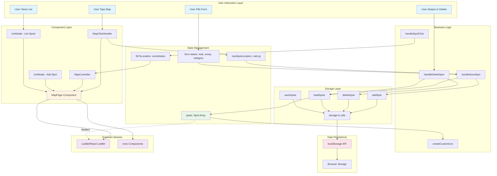

# My Spot App 📍

A simple location-based map application built with Ionic React to explore and bookmark favorite places with custom notes and emojis.

## 🎓 Learning Reflection

### Background Context
As a junior full-stack developer with experience in React and React Native, this project served as my introduction to the Ionic framework. Coming from React Native's native-focused approach, I found Ionic's web-first cross-platform philosophy quite refreshing.

### Key Takeaways

**React Fundamentals Revisited:**
- **Array Mapping**: Got to practice `.map()`, `.filter()`, and `.findIndex()` extensively when rendering markers and managing the spots array
- **State Management**: Reinforced understanding of `useState` and `useEffect` hooks for managing component state and side effects
- **Component Composition**: Learned the importance of breaking down complex UIs (noted that MapPage.tsx could benefit from smaller, reusable components)

**New Ionic Concepts:**
- **IonSelectOption**: Discovered how Ionic's form components like `IonSelect` and `IonSelectOption` provide native-like dropdowns with minimal setup - much simpler than React Native's `Picker` which requires more configuration
- **IonModal**: Built-in modal system is straightforward compared to React Native's Modal component, with better backdrop handling out of the box
- **IonItemSliding**: Swipe-to-delete functionality comes pre-built, whereas in React Native you'd need libraries like `react-native-gesture-handler` or custom PanResponder logic
- **IonFab**: Floating action buttons are ready to use, no need for absolute positioning hacks

**Ionic vs React Native Comparison:**
| Feature | Ionic | React Native |
|---------|-------|--------------|
| Platform Approach | Web-first (renders in WebView) | Native components |
| Setup Complexity | Minimal, batteries included | Requires more native dependencies |
| UI Components | Pre-styled, web standards | Requires styling from scratch |
| Third-party Libraries | Many web libraries work | Needs RN-specific packages |
| Development Speed | Faster iteration | Slightly more setup time |

**Challenges & Solutions:**
- **Rendering Issues**: Initially struggled with displaying the correct spot information in markers and popups. A quick Google search led me to understand Leaflet's `divIcon` API better and how to properly pass props to custom components
- **Storage Persistence**: Had a moment where data wasn't loading correctly - realized I needed to handle the `null` case in `loadSpots()` properly
- **Map Events**: Understanding how to use `useMapEvents` from react-leaflet required reading the docs, but once I got it, the pattern was elegant

### What I Appreciated

**Ionic's "Batteries Included" Philosophy:**
The Ionic package comes with almost everything needed for mobile development pre-installed - UI components, icons (`ionicons`), routing, and platform APIs. Compared to React Native where you're constantly installing and linking packages (`react-navigation`, `react-native-vector-icons`, etc.), Ionic's ecosystem feels more cohesive and ready-to-go.

**Development Experience:**
Building this app was genuinely enjoyable. The hot-reload was fast, the components were predictable, and the documentation was helpful. It felt like building a web app with mobile superpowers.

### Room for Improvement

This app is far from production-ready but serves its purpose as a learning project. For future iterations, I would:
- **Component Architecture**: Break down `MapPage.tsx` into smaller components (`SpotModal`, `SpotList`, `MapView`, etc.)
- **TypeScript**: Add stricter type checking and better interfaces
- **Error Handling**: Implement proper error boundaries and user feedback
- **Testing**: Add unit tests for storage utilities and component tests
- **Features**: Add photo uploads, geolocation, spot sharing, and search functionality

### Conclusion

For a junior developer coming from React/React Native, Ionic provides a gentle learning curve with immediate productivity. While it may not offer the native performance of React Native for complex applications, for rapid prototyping and simple apps like this, it's an excellent choice. I'm looking forward to exploring Capacitor's native APIs and building more complex applications with Ionic.

---

## 🗺️ Features

- 🗺️ Interactive Leaflet map with OpenStreetMap tiles
- 📍 Tap-to-drop custom pins with emoji markers
- 🎨 Color-coded categories (Cafe, Park, Restaurant, Secret, Other)
-  LocalStorage persistence (no backend required)
- 📱 Mobile-responsive design
- 🗑️ Swipe-to-delete functionality
- 🎯 Click-to-fly navigation from list to map location
- 👋 Demo spot on first launch

## 🚀 Getting Started

### Installation

```bash
npm install
```

### Development Server

```bash
npm run dev
# or
ionic serve
```

### Build for Production

```bash
npm run build
```

## 🏗️ Architecture Overview



### Data Flow Explanation

1. **User Interaction → Component**: User taps map, triggering `MapClickHandler` which captures coordinates
2. **Component → State**: Coordinates stored in `newSpotLocation` state, modal opens
3. **State → Business Logic**: User submits form, `handleSaveSpot` creates Spot object
4. **Business Logic → Storage**: `addSpot()` utility adds spot to localStorage
5. **Storage → Persistence**: Data serialized to JSON and saved in browser storage
6. **Persistence → State**: `loadSpots()` retrieves data, updates `spots` state
7. **State → Render**: Leaflet renders markers using custom icons based on spot data

## 📂 Project Structure

```
src/
├── components/
│   └── MapController.tsx      # Handles map navigation/flyTo
├── pages/
│   ├── MapPage.tsx            # Main map view (needs refactoring)
│   └── MapPage.css            # Responsive styles
├── types/
│   └── Spot.ts                # TypeScript interfaces & enums
└── utils/
    └── storage.ts             # localStorage CRUD operations
```

## 🛠️ Tech Stack

- **Framework**: Ionic React 8.x
- **UI Library**: React 18.x
- **Language**: TypeScript 5.x
- **Build Tool**: Vite 4.x
- **Map Library**: Leaflet 1.9.x + React-Leaflet 4.x
- **Storage**: Browser localStorage API
- **Icons**: Ionicons

## � Implementation Details

### Core Functionality

**Storage Layer** (`src/utils/storage.ts`)
- Implemented full CRUD operations for localStorage
- Functions: `loadSpots()`, `saveSpots()`, `addSpot()`, `deleteSpot()`, `updateSpot()`, `clearAllSpots()`
- Proper JSON serialization/deserialization with null handling

**Map Interactions** (`src/pages/MapPage.tsx`)
- Click-to-add spots using `useMapEvents` hook from react-leaflet
- Custom marker icons with `L.divIcon()` displaying category colors and emojis
- Fly-to navigation feature using separate `MapController` component
- Form validation and state management for new spots

**UI Components**
- IonModal for adding new spots with form inputs
- IonModal for listing all spots with swipe-to-delete
- IonFab button for quick access to spot list
- Responsive CSS with mobile-optimized touch targets

### Key Technical Decisions

1. **localStorage over Backend**: Kept it simple for a learning project, perfect for understanding client-side persistence
2. **Separate MapController**: Isolated map navigation logic into its own component for better separation of concerns
3. **Demo Spot**: Added welcome spot on first launch to immediately show app functionality
4. **Category Colors**: Used TypeScript Record type for type-safe color mapping

## 📝 Development Notes

**App runs at**: `http://localhost:5173` (Vite dev server) or via `ionic serve`

**Known Limitations**:
- No data synchronization across devices
- Large monolithic MapPage.tsx component (future refactor needed)
- Basic error handling
- No unit tests implemented

**Future Improvements**:
- [ ] Break down MapPage into smaller components
- [ ] Add photo upload with Capacitor Camera API
- [ ] Implement geolocation for "current location" feature
- [ ] Add spot categories filter/search
- [ ] Export/import spots as JSON
- [ ] Add proper error boundaries

## 📚 Resources Used

- [Ionic React Documentation](https://ionicframework.com/docs/react)
- [Leaflet API Reference](https://leafletjs.com/reference.html)
- [React Leaflet Guide](https://react-leaflet.js.org/)
- [MDN Web Docs - localStorage](https://developer.mozilla.org/en-US/docs/Web/API/Window/localStorage)

## 📄 License

This is a learning project for **Lab 3** coursework. Repository will be archived 15 days after the submission deadline.

---

*This README was improved and organized by **Claude Sonnet 3.5** AI assistant.*